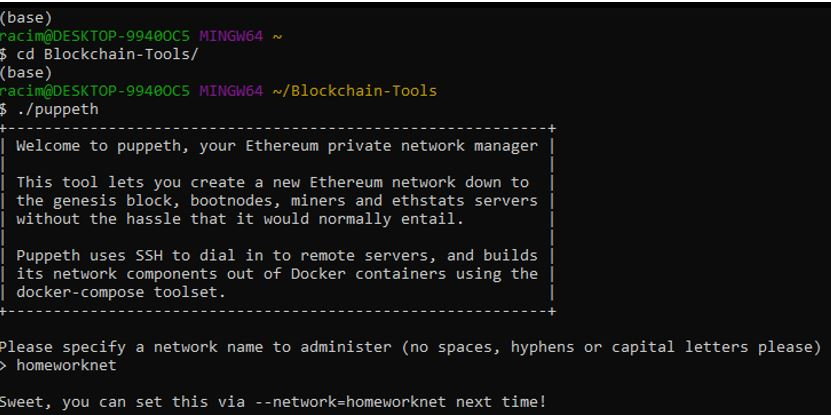
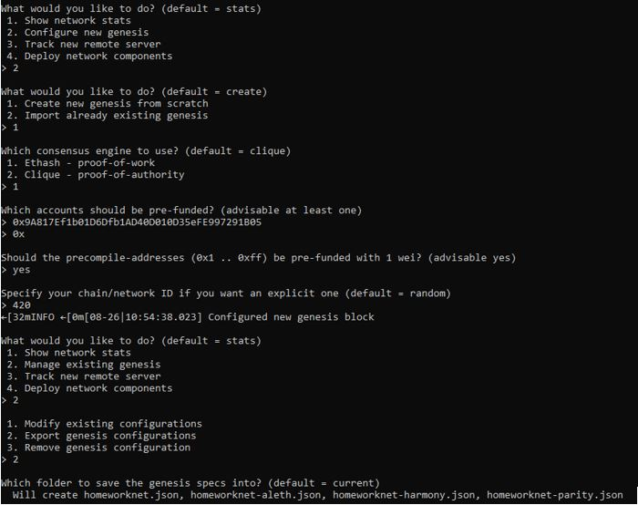
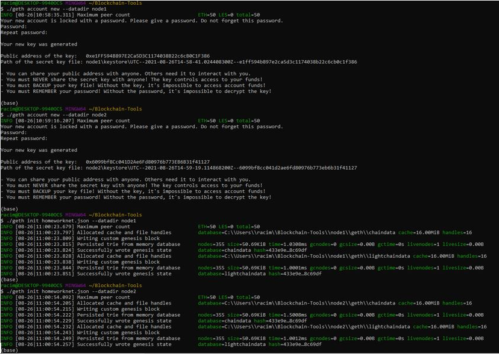
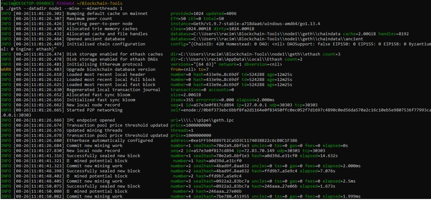
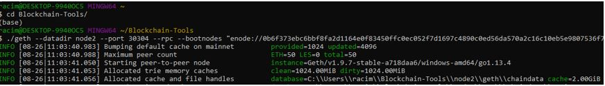
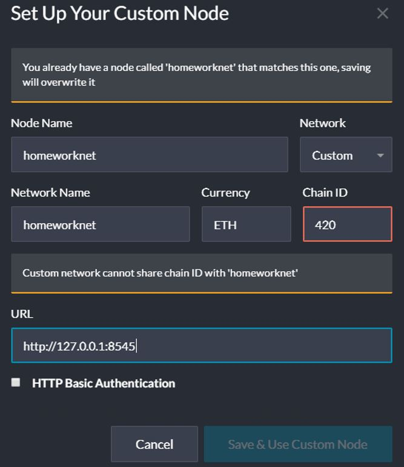
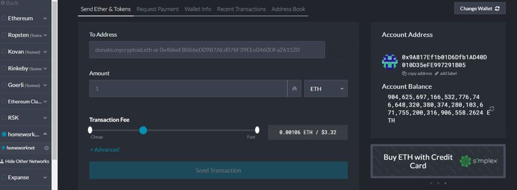
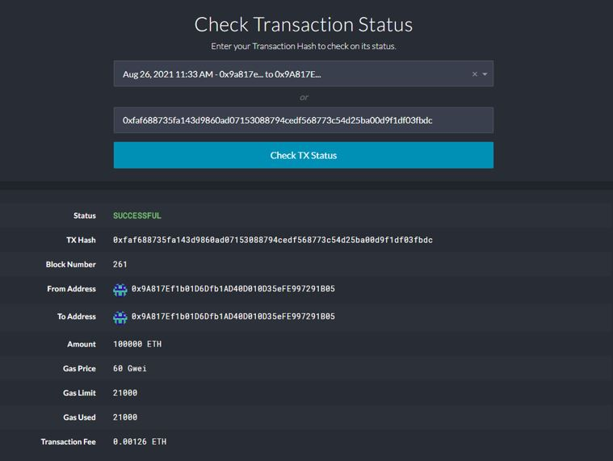

# HW-Blockchain-18
## Setting up the Genesis block using puppeth and running both Node1 and Node2: 
*   First, we create a Genesis Block using puppeth, a tool bundled with the Go Ethereum tool. Then I give a name to the network I created on my personal machine. The network name is homeworknet

*   I then had to tell the machine that I wanted to create a new genesis block and that I wanted to create it from scratch. I selected Ethash – proof of work and then gave it my wallet address that I wanted to prefund. This will then create four .json files and we need only the homeworknet.json

*   I then created two folders Node1 and Node2 and initialized them

*  	Then I ran both Node1 and Node2 For Node1 I used the command: ./geth --datadir node1 --mine --minerthreads 1 and For Node2 I used the command: ./geth --datadir node2 --port 30304 --rpc --bootnodes "enode://<replace with node1 enode address>" --ipcdisable
 

## Transact on the test net custom node: 
*   Once both nodes were running I opened MyCrypto and wanted create my network: Homeworknet
*   First you have to set up the custom Node

*  Then get to wallet info to get the private key of that wallet. Once you connect to the wallet try and transact 

*   My transaction went through successfully

